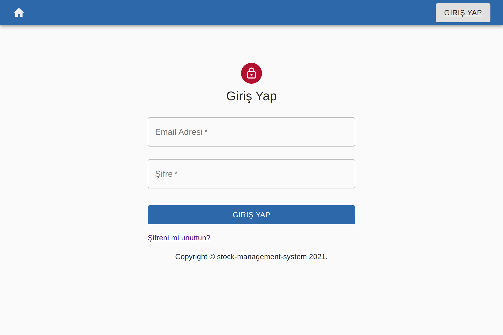
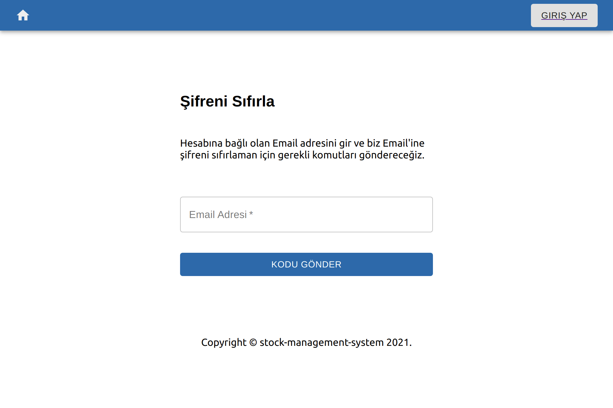
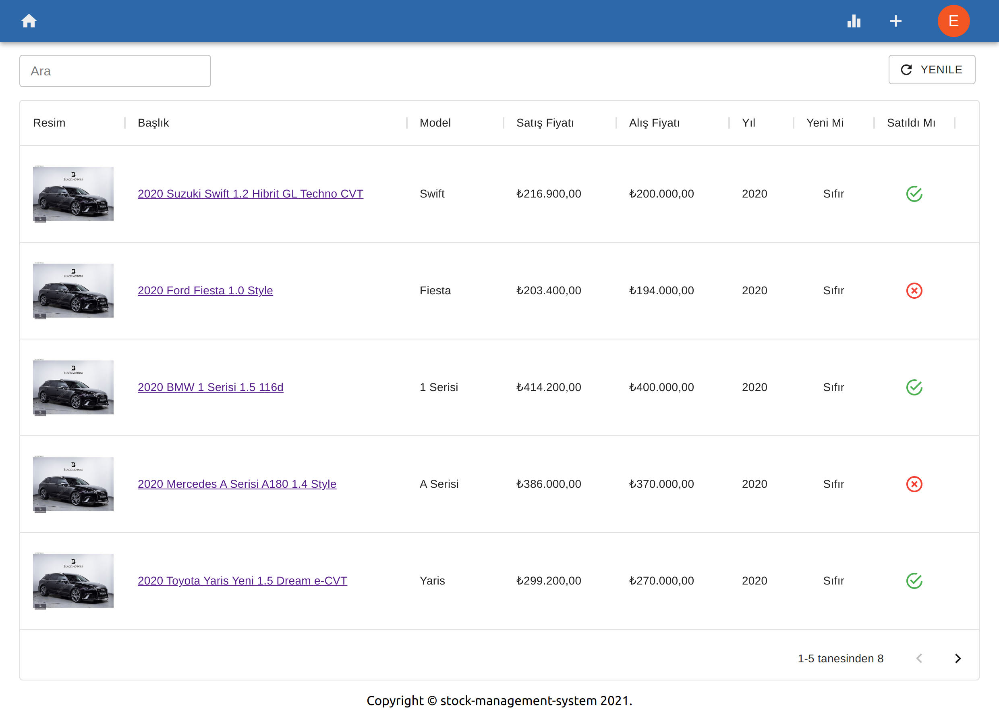
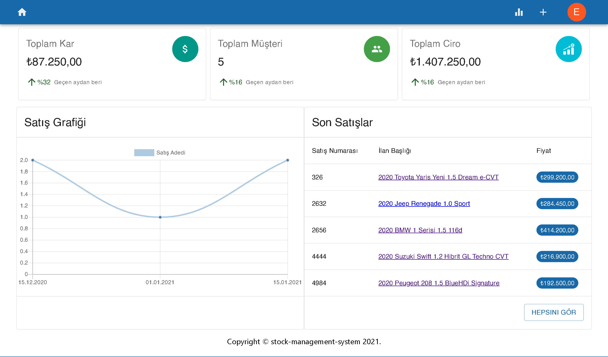
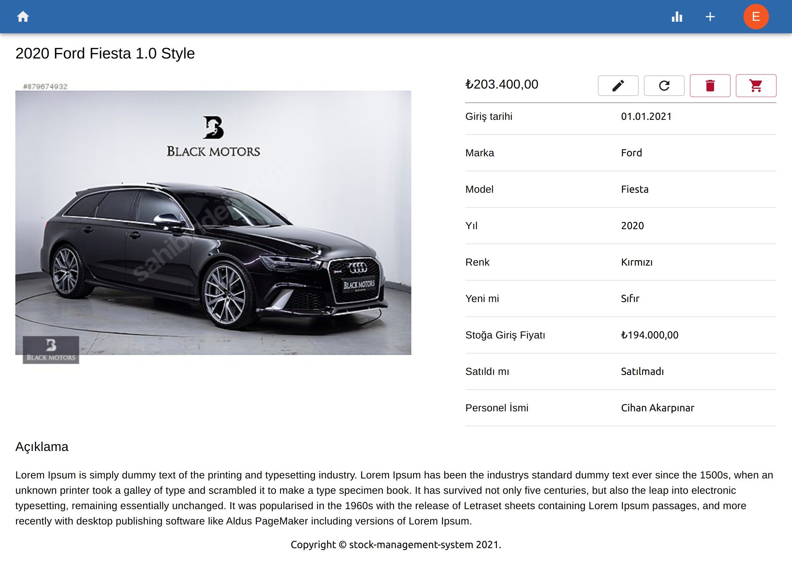
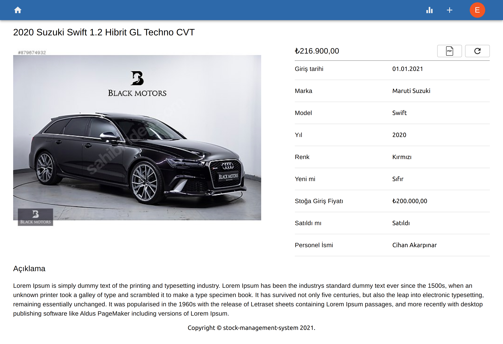
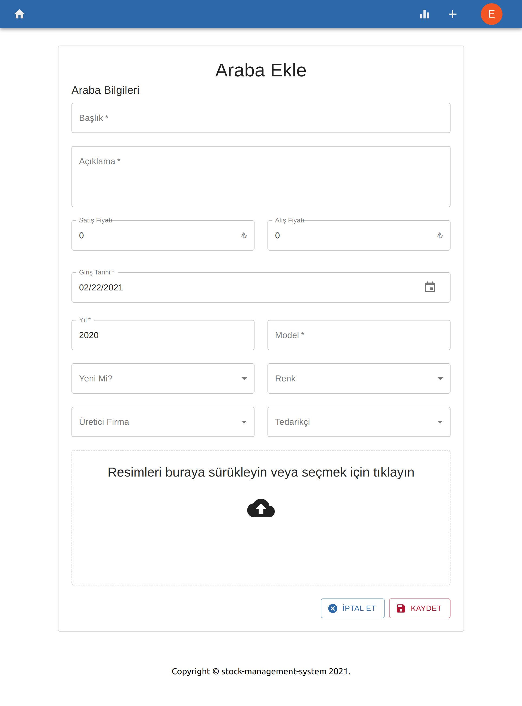
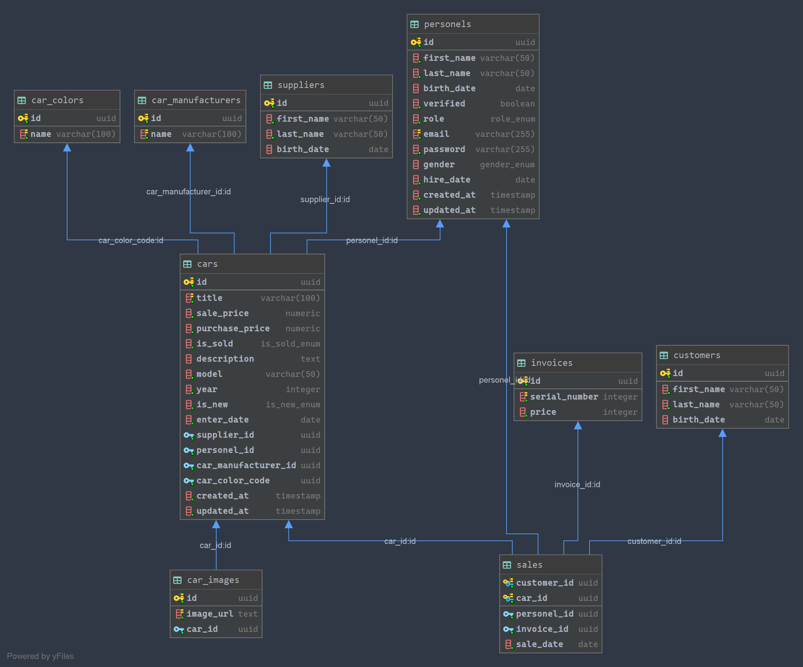

## Stok Takip

Stok Takip is an open-source full-stack project that can handle personel registration, car stock management operations and so on. I built this app using Node.js, React, Express, Postgres.

### Images

#### Login

<p align="center">
    
</p>

#### Forgot Password

<p align="center">
    
</p>

#### Home

<p align="center">
    
</p>

#### Daily Sales Chart

<p align="center">
    
</p>

#### Unsold Car Detail

<p align="center">
    
</p>

#### Sold Car Detail

<p align="center">
    
</p>

#### Car Add

<p align="center">
    
</p>

### Database Design

<p align="center">
    
</p>

### Installation

#### Backend Api

```bash
   cd api && docker-compose up
```

#### Client

```bash
   cd client && yarn start
```
